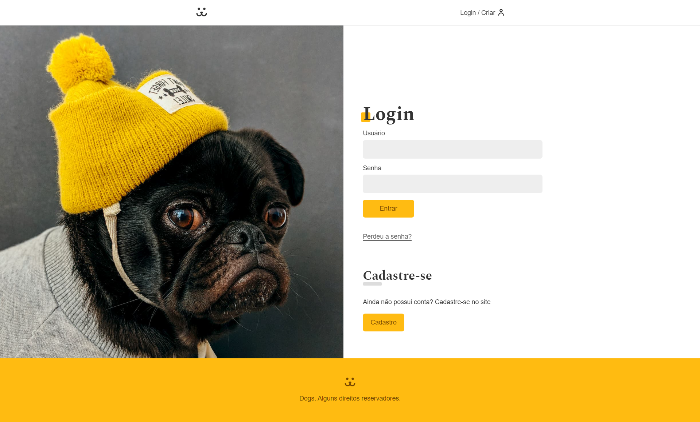
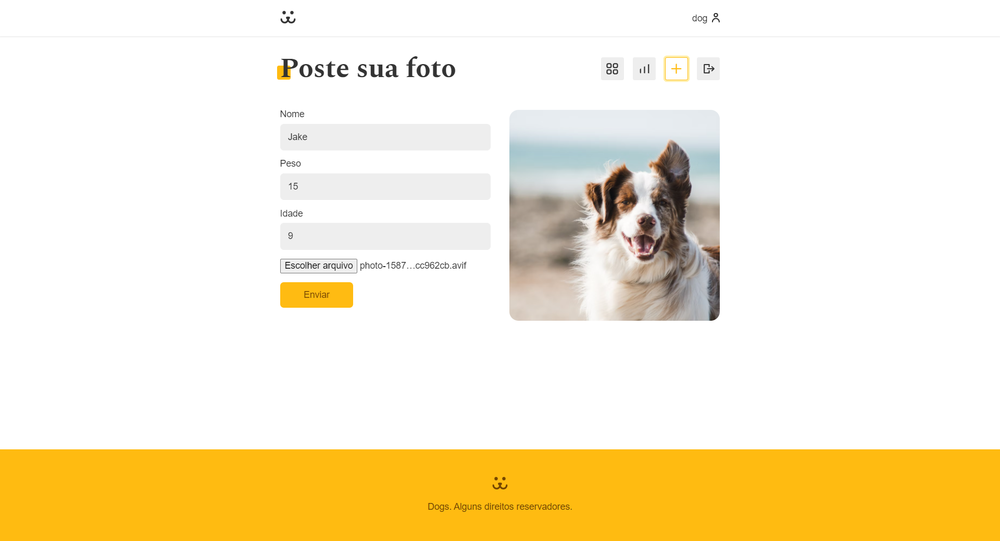

# Dogs

## 📝 Sobre

**Dogs** é uma site uma rede social para cachorros.

O site possui sistema de login e permite criar perfis, postar e deletar fotos e comentarios, além de graficos para checar o numero de acessos em suas fotos.

Outras implementações:
- Criação de Custom Hooks
- Password Lost/Reset
- Image Skeleton
- Animação de SVGS
- Rotas protegidas
- Erros e carregamentos, etc

---------

## 🖥️ Demonstração

<h1>
     
  
<h1>
     
  
<h1>
     

----------


## 🚀 Tecnologias e ferramentas utilizadas

- **React**
- **React Router**
- **Victory - Graficos**

---------

## 💻 Instalação e uso

```bash
# Abra um terminal e copie este repositório com o comando
$ git clone https://github.com/RodrigoFonsecaG/Dogs.git
# ou use a opção de download.

# Entre na pasta do projeto 
$ cd dogs

# Instale as dependências
$ npm install

# Rode o aplicação
$ npm start

#Por fim acesse o localhost:3000 no seu navegador.
```

-----------
